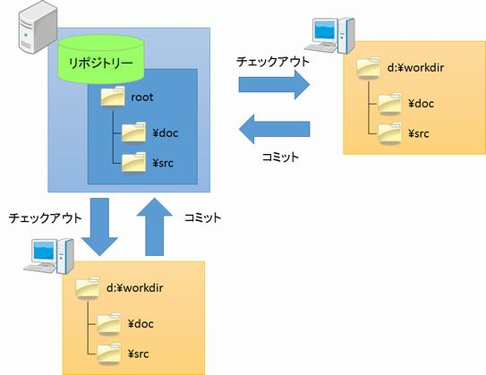
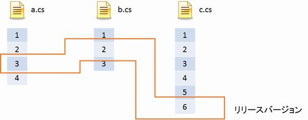
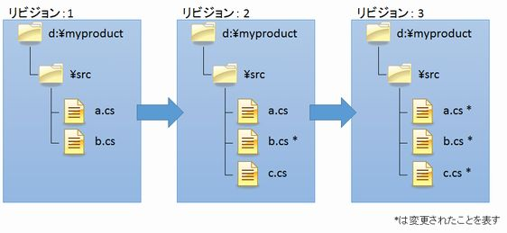

[↑目次](readme.md "目次")

# Subversion（SVN）とは？

Subversion（SVN）とは、OSS（Open Source Software、オープンソースソフトウェア）のVCS（Version Control System、バージョン管理システム）の一つです。

その特徴は主に以下の3つです。

1. [集中型](#centralized)
1. [フォルダーツリーのバージョン管理](#folder-tree)

一つずつ見ていきましょう。

## 1. 集中型
SVNのリポジトリはプロダクトについて一つだけ存在し、その一つをメンバー全員が共有します。そして、リポジトリから作業コピーを取得し、作業を行ったのち、リポジトリに反映します。

なお、SVNでは作業コピーを取得することを「チェックアウト」、作業結果をリポジトリに反映させることを「コミット」と呼びます。

図1-1 集中型リポジトリ

## 2. フォルダーツリーのバージョン管理

初期のVCSはファイル単位にバージョンを管理していました。最初これでもよかったのかもしれませんが、規模が大きくなるにつれ、ファイル暖いではバージョン管理が難しくなってきました。

例えば、リリースを行ったタイミングのバージョンを見たくても、あるファイルのバージョンは3でまたあるファイルのバージョンが5である、といったことが起きます。こうなってしまうと、リリースしたタイミングの各ファイルのバージョンを、別途管理しないといけなくなってしまいます。

あるタイミングのリポジトリに「ラベル」を付けて識別するといった方法もありましたが、管理が複雑であることは変わりません。

図1-2 ファイル単位のバージョン管理

そこで、SVNはこの問題を「フォルダーツリーの履歴」を管理することで解決しました。つまり、あるバージョンを参照することで、そのバージョンのすべてのフォルダー、ファイルを参照できるようになるのです。

なお、SVNのバージョン番号はリポジトリで一意となる1から始まる連番で、「リビジョン」と呼ばれます。

図1-3 フォルダーツリーのバージョン管理

SVNの大まかな特徴を押さえたところで、実際にインストールして使いながら、使い方、用語を覚えていきましょう。

[→ 2章 SVNの導入](2.installing-svn.md "SVNの導入")

----------

