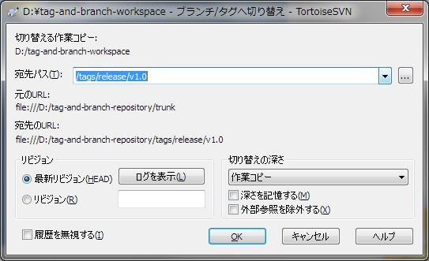

[↑目次](README.md "目次") | [← 9章 タグとブランチ - タグの作成](9.tag-and-branch-2.md "タグとブランチ - タグの作成")

# タグとブランチ - タグの作成

本章では作成したタグを使い、バージョンを復元したり、対象バージョンをエクスポートする方法について学びましょう。

1. [更なるコミット](#commit-more)
1. [タグに戻す](#reset-to-tag)
1. [タグのエクスポート](#export-from-tag)

## 1. 更なるコミット

まずは、コミットしてもタグが変わらないことを確認するため、hello.txtの内容を

    world!

から

    Japan!

に変更してコミットしましょう。コミット後にリポジトリブラウザーで確認すると、trunkフォルダーは変更されていますが、tags/release/v1.0フォルダーは変更されていないことが確認できます。

図10-1 コミット後のtrunkフォルダー

図10-2 コミット後のtags/release/v1.0フォルダー

## 2. タグに戻す

それではタグの活用法の一例として、タグの時点の成果物を復元してみましょう。最初は「切り替え」という方法です。

「切り替え」では、作業コピーが見ているリポジトリのフォルダーを「切り替え」ます。つまり、trunkからtags/release/v1.0に切り替えます。

図10-3 切り替えの処理イメージ

「切り替え」を行うには、作業コピーで右クリックし、「TortoiseSVN」→「切り替え」を選択します。

図10-4 「切り替え」メニュー

「ブランチ/タグの切り替え」ダイアログが表示されるので、「宛先」欄に切り替え先のタグのパスを入力して、「OK」ボタンをクリックします。「...」ボタンをクリックすれば、リポジトリブラウザーで宛先を選択できます。

図10-5 「ブランチ/タグの切り替え」ダイアログ

作業コピーが見ているリポジトリーパスがタグに代わるとともに、作業コピーの内容もタグのものに置き換わります。

図10-6 「切り替え 終了」ダイアログ

hello.txtの内容を確認すると、元の

    world!

になっていることが確認できます。

なお、「切り替え」を使う際は次の点に注意しましょう。

- あくまでタグの復元である  
trunkの作業コピーのバージョンを戻すわけではなく、原理上はタグの作業コピーに切り替わっているだけです。そのため、そのままコミットしてもtrunkは変更されません。また、コミットしたらタグのスナップショットとしての意味がなくなってしまいます。
- 成果物をすべて切り替える  
切り替えはtrunk配下すべてを切り替えるため、リポジトリが大きくなってくると、必然的に切り替えに時間がかかります。

## 3. タグのエクスポート

タグのバージョンを参照したい、という場合、本来は作業コピーを切り替える必要はなく、ただただファイルが見れればよいということもよくあります。そういった時は、「エクスポート」機能を使いましょう。

「エクスポート」はリポジトリの特定フォルダのファイル群を取り出す操作です。チェックアウトと違い、作業コピーを作りません。したがって、納品物件をリポジトリから取り出す、といった用途によく使われます。

図10-7 エクスポートの処理イメージ

エクスポートはリポジトリブラウザーから行います。対象のフォルダー、今回はタグエクスポートしたいのでtags/release/v1.0を右クリックし、「エクスポート」を選択します。

図10-8 「エクスポート」メニュー

「エクスポート」ダイアログが表示されるので、「エクスポート先ディレクトリ」に任意のフォルダーを指定して、「OK」ボタンをクリックします。

図10-9 「エクスポート」ダイアログ

「エクスポート 終了」ダイアログが表示され、エクスポートが完了します。エクスポート先のhello.txtの内容を確認すると、やはり元々の

    world!

になっていることが確認できます。

これでタグに関する一通りの操作が行えるようになりました。次の章からは、ブランチの作成からマージまでを扱います。

[→ 11章 タグとブランチ - ブランチの作成](11.tag-and-branch-4.md "タグとブランチ - ブランチの作成")

----------

