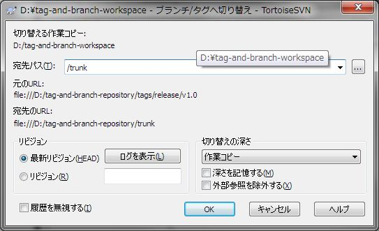
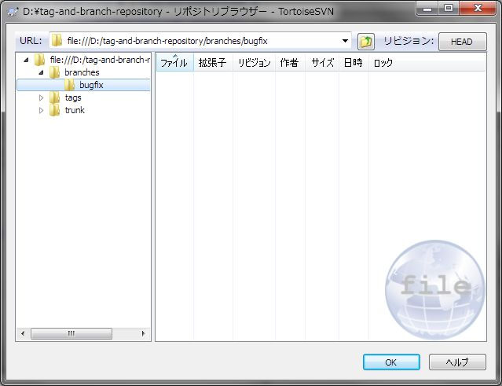
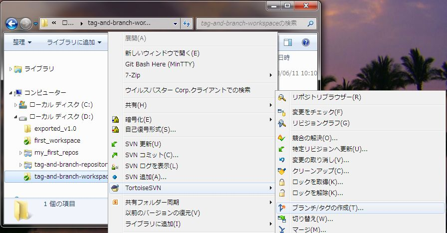
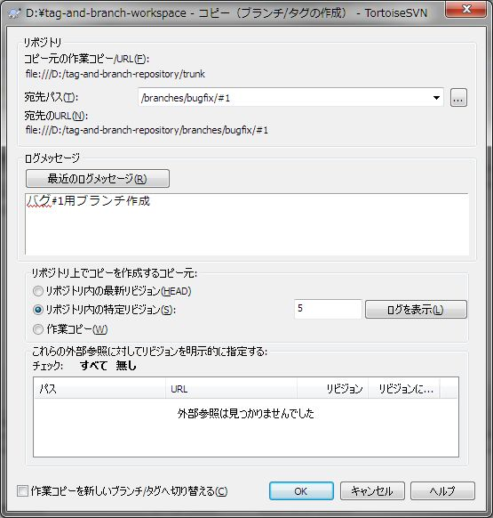
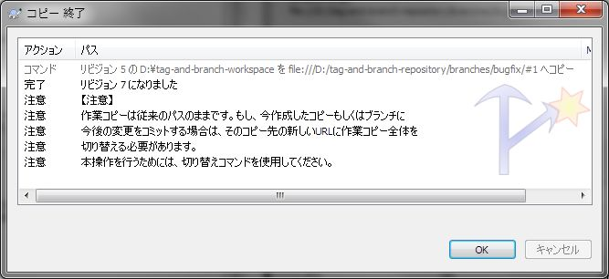
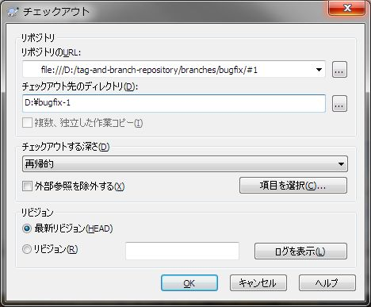

[↑目次](README.md "目次") | [← 10章 タグの復元とエクスポート](10.tag-and-branch-3.md "タグとブランチ - タグの復元とエクスポート")

# タグとブランチ - ブランチの作成、チェックアウト

本章では実際にブランチを作成する方法について学びましょう。

1. [ブランチの作成](#create-branch)
1. [ブランチのチェックアウト](#checkout-branch)

## 1. ブランチの作成

まず、作業前に前章の「切り替え」の手順で作業フォルダーをtrunkに切り替えておきましょう。

図11-1 trunkへの切り替え

準備ができたので、タグの時と同じように、ブランチ用のフォルダーを作成しましょう。今回はバグ修正ブランチという位置づけとして、branches/bugfixフォルダーを作成します。

図11-2 バグ修正ブランチ用フォルダー作成

そして、branches/bugfixフォルダーにtrunkをコピーします。今回はタグとは違う手順で行ってみましょう。作業コピーを右クリックし、「TortoiseSVN」→「ブランチ/タグの作成」を選択します。

図11-3 ブランチ/タグの作成

すると、「コピー（ブランチ/タグの作成）」ダイアログが表示されるので、宛先パスに作成するブランチのパス、ログメッセージを入力して「OK」ボタンをクリックします。今回は、バグ番号1ということで、/branches/bugfix/#1を宛先に指定します。

図11-4 ブランチ名、ログメッセージの入力

次の「コピー終了」ダイアログが表示され、ブランチが作成されます。

図11-5 ブランチ作成完了

「コピー終了」ダイアログに書いてある通り、このままではブランチの編集はできません。切り替えなどが必要ですが、今回はブランチで別途作業を行うこととして、ブランチをチェックアウトします。

## 2. ブランチのチェックアウト

ブランチのチェックアウトはtrunkのチェックアウトとチェックアウト元フォルダーが違うだけです。D:\bugfix-1フォルダーにチェックアウトしてみましょう。

図11-6 ブランチのチェックアウト

作業コピーのhello.txtを内容確認すると、trunkと同じ

    Japan!

になっていることが確認できます。

次の章ではブランチでの作業結果のコミットと、trunkへのマージを行ってみましょう。

----------

