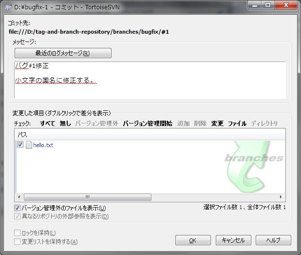
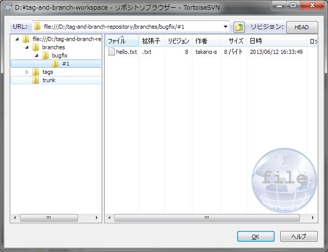

[↑目次](README.md "目次") | [← 11章 タグとブランチ - ブランチの作成、チェックアウト](11.tag-and-branch-4.md "タグとブランチ - ブランチの作成、チェックアウト")

# タグとブランチ - ブランチの変更、マージ

本章ではブランチを変更し、trunkにマージする手順について学びましょう。

1. [ブランチの変更](#modify-branch)
1. [トランクの変更](#modify-trunk)
1. [ブランチのマージ](#merge-branch)

## 1. ブランチの変更

まずはブランチに変更を加え、その名の通りtrunkから分岐させてみましょう。hello.txtを開き、`Japan!`を先頭が小文字の`japan!`に変更してコミットします。

図12-1 ブランチでの変更、コミット

結果、branch/bugfix/#1フォルダーのファイルは変更されましたが、trunkフォルダーのファイルは変更されていないことが確認できます。

図12-2 branch/bugfix/#1フォルダー

図12-3 コミット後のtrunkフォルダー

----------

