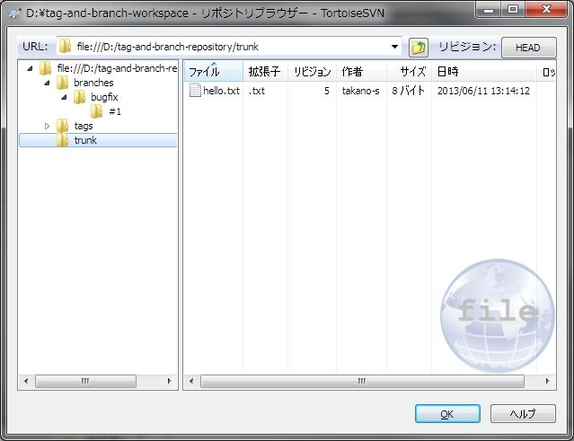
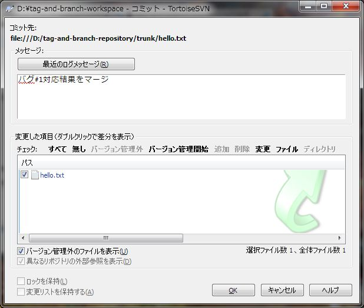

[↑目次](README.md "目次") | [← 11章 タグとブランチ - ブランチの作成、チェックアウト](11.tag-and-branch-4.md "タグとブランチ - ブランチの作成、チェックアウト")

# タグとブランチ - ブランチの変更、マージ

本章ではブランチを変更し、trunkにマージする手順について学びましょう。

1. [ブランチの変更](#modify-branch)
1. [trunkの変更](#modify-trunk)
1. [ブランチのマージ](#merge-branch)

## 1. ブランチの変更

まずはブランチに変更を加え、その名の通りtrunkから分岐させてみましょう。hello.txtを開き、`Japan!`を先頭が小文字の`japan!`に変更してコミットします。

図12-1 ブランチでの変更、コミット

結果、branch/bugfix/#1フォルダーのファイルは変更されましたが、trunkフォルダーのファイルは変更されていないことが確認できます。

図12-2 branch/bugfix/#1フォルダー

図12-3 コミット後のtrunkフォルダー

## 2. trunkの変更

次に、ブランチの作業がtrunkでの作業と並行して行えることを確認するため、trunkでも変更を加えます。trunkの作業コピーであるD:\tag-and-branch-workspaceフォルダーに、以下の内容のこんにちは.txtを作成し、追加、コミットしてください。

    日本！

図12-4 trunkでのコミット

## 3. ブランチのマージ

それでは、バグ修正が終えたブランチをtrunkにマージしてみましょう。trunkの作業コピーを右クリックし、「TortoiseSVN」→「マージ」を選択します。

図12-5 マージ

すると、「マージ」ダイアログが表示され、「マージタイプ」の選択画面になります。今回はブランチをマージしたいので「リビジョンの範囲をマージ」を選択して「次へ」ボタンをクリックします。

図12-6 「マージ」ダイアログ

次に、マージ元のリビジョンを指定する画面になります。ここではマージ対象ブランチのリビジョンを指定するので、branches/bugfix/#1フォルダーを指定して、「次へ」ボタンをクリックします。なお、「元のURL」欄には、ブランチのフルパスを入力する必要があります。

図12-7 マージ元の指定

最後に「マージの設定」画面になりますが、今回は特に設定を変更せずに、「マージ」ボタンをクリックします。

図12-8 マージの設定

すると、おや？操作に失敗しましたね。

図12-9 マージの再統合 失敗

エラーの内容を読んでみると、

> エラー: Cannot merge into mixed-revision working copy [5:9]; try updating first  

「複数のリビジョンを持った作業コピーへのマージはできない」、「先に更新してみて」と書いてあります。とりあえずわからないままでよいので、「OK」ボタンをクリックしましょう。すると、親切に「更新」を促す確認ダイアログが表示されました。とりあえず「更新」しましょう（「更新」については、次の章でくわしく説明します）。

図12-10 更新を促すダイアログ

更新が行われます。

図12-11 更新 終了

すると、自動的に再度マージが行われ、今度は成功します。

図12-12 マージの再統合 終了

ここで作業コピーの様子を見てみましょう。hello.txtが変更されているのが確認できます。

図12-13 マージ後の作業コピー

第4章で行った「SVN 差分を表示」を行ってみましょう。すると、branches/bugfix/#1ブランチで行った変更が、hello.txtに反映されていることが確認できます。

図12-14 マージ後の差分

最後に、このままではリポジトリに反映されないので、いつものようにコミットしてマージ完了です。

図12-15 マージ結果のコミット

さて、5章にわたってタグとブランチについて説明してきました。成果を残すためのタグ、メインラインとは独立して作業を進めるためのブランチ、という手段を活用することで、より自由に成果物のバージョンを制御できることが分かったかと思います。

次の章からは、いよいよ複数人でのリポジトリ共用方法について学んでいきます。

[→ 13章 チームでの利用 - 作業ベース](13.team-use-1.md "チームでの利用 - 作業ベース")

----------

