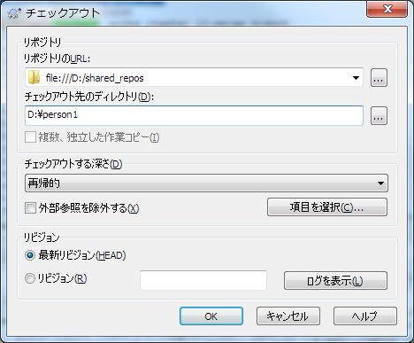

[↑目次](README.md "目次") | [← 12章 タグとブランチ - ブランチの変更、マージ](12.tag-and-branch-5.md "タグとブランチ - ブランチの変更、マージ")

# チームでの利用 - 作業ベース

SVNはVCSであり、チーム開発のインフラとしての役割も求められています。チーム開発は自分以外のメンバーによりコミットされるということです。したがって、バージョン管理が若干複雑になりますので、しっかり理解しながら進めていきましょう。

まずは、基本となる作業ベースについて説明します。

1. [作業ベースとは？](#what-is-working-base)
1. [複数人によるコミット](#commit-by-multi-user)
1. [作業ベースに「戻す」](#rollback-to-working-base)
1. [更新](#update-to-head)

## 1. 作業ベースとは？

「作業ベース」とはその名の通り「作業の元となるリビジョン」を表した概念です。具体的には、作業コピーをチェックアウトした時点、コミットした時点のリビジョンが該当します（図13-1）。「差分」を見たり、「元にに戻す」と言った処理はすべて、「作業ベース」を起点として行われます。

図13-1 作業ベースのイメージ

この作業ベースはあくまで「作業コピー」が参照しているリビジョンです。したがって、他のメンバーによってコミットされ、リポジトリのリビジョンが先に進んでも、自動的に変更されたりはしません。

図13-2 他者によるコミットイメージ

リポジトリの最新のリビジョンを作業ベースとするための操作が「更新」です。「更新」することにより、リポジトリの最新ソースの取得が行われ、作業ベースが最新リビジョンに変更されます。

図13-3 更新イメージ

それでは、実際に操作しながら、作業ベースの動作を確認してみましょう。

## 2. 複数人によるコミット

まずはいつものようにリポジトリを作成します。今回は複数人での作業をシミュレーションするので、リポジトリ名を"shared_repos"としておきましょう。また、以下の内容のhello.txtファイルを作成し、インポートしておきます。

    world!

図13-4 共有リポジトリ作成と初期インポート

次に一人目の作業者としてperson1フォルダーにチェックアウトしましょう。

図13-5 一人目の作業者チェックアウト

その際、「チェックアウト 終了」ダイアログに"リビジョン 1になりました"というメッセージが表示されます。これが作業ベースです。

図13-6 一人目の作業者チェックアウト 終了

次に、person1フォルダーのhello.txtを以下のように変更し、コミットします。

    svn world!

図13-7 一人目の作業者 コミット

コミットを終えると、今度は"リビジョン 2になりました"というメッセージが表示され、作業ベースが2に変更されたことがわかります。

図13-8 一人目の作業者 コミット終了

では、引き続き二人目の作業者の作業として、person2フォルダーへのチェックアウト、ファイルを以下のように変更してコミットしてみましょう。

    wonderful svn world!

この時、person1の作業コピーでログを見てみましょう。

図13-9 一人目の作業者 ログ表示

ログを見ると、リビジョン 2の行が太字になっています。つまり、これが作業コピーのリビジョンということです。別の作業者がリポジトリにコミットしても、作業ベースは自動的に変更されないことが、これでわかります。

[→ 14章 チームでの利用 - 衝突の発生](14.team-use-2.md "チームでの利用 - 衝突の発生")

----------

