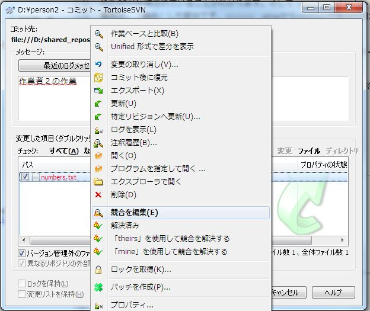

[↑目次](README.md "目次") | [← 13章 チームでの利用 - 作業ベース](13.team-use-1.md "チームでの利用 - 作業ベース")

# チームでの利用 - 競合

チームで作業を進めていく上で、メンバー間の協調作業は欠かせません。そのため、事前に作業範囲が重ならないように調整することが大事です。

しかし、どうしても同じ場所に同時に変更を加える必要も出てきます。そんなときはメンバー間の作業が「競合」してしまうことがあります。本章ではそんな時にどのように対処すればよいのか説明します。

1. [競合とは？](#what-is-conflict)
1. [競合の発生](#occuring-conflict)
1. [競合の編集](#edit-conflict)
1. [競合の解決](#resolve-conflict)

## 1. 競合とは？

「競合」とは二人以上の作業者（過去の自分を含む）の作業範囲が重なってしまい、VCSが成果物の「最新」状態を自動的に推測することができなくなった状態を指します。SVNでの発生タイミングは、前章で紹介した「更新」のタイミング、そして[12章](12.tag-and-branch-5.md)で紹介したような別リビジョンの成果を「マージ」するタイミングです。

競合が発生した場合、その後行う対処には次の3通りがあり、競合先ファイルの作業者をログ等で確認の上、関係者と調整してどの方法を選ぶか決定します。

* 競合先のバージョンを採用する
* 自分のバージョンを採用する
* どちらのバージョンも採用しない
* 競合を編集する

### 競合先のバージョンを採用する

そのファイルの最新リビジョンを正とする方法です。この方法を選択した場合、自分が行った作業の成果は失われます。

### 自分のバージョンを採用する

手元のファイルを正とする方法です。この方法を選択した場合、最新リビジョンの成果は上書きされます。

### どちらのバージョンも採用しない。

競合先、自分のどちらのバージョンも採用せず、変更前に戻す方法です。この方法を選択した場合、最新リビジョンの成果を上書きし、自分が行った作業の成果が失われます。

### 競合を編集する

最新リビジョンの内容を元に、自分の作業の成果の一部を反映させる方法で、4つの対応方法の中では最も最初に検討すべき法です。しかし、対象成果物についてよく知っていて、どのように直せばよいか知っている必要が有るため、最もスキルが問われる方法でもあります。

そして、競合への対応が終わった後は、「競合の解決」を行い競合が解消されたことをSVNに通知し、成果物を「コミット」する必要があります。

それでは、今回は「更新」により競合を発生させ、「競合の編集」を行い、「競合を解決」する方法をシミュレーションしてみましょう。前章で作成したリポジトリ、及び作業コピーを引き続き使用します。

## 2. 競合の発生

まず、競合の動きがよく分かるように、以下の様な数値を並べたnumbers.txtファイルをperson1の作業コピー上に作成して、追加、コミットします。その後、person2で更新を行い、numberx.txtを取得しておきます。

    10
    20
    30
    40
    50
    60
    70

次に、person1作業コピーにて、numbers.txtに①15を追加、②40を43に変更、③60を削除してコミットします。編集後のファイルは次のようになります。

    10
    15
    20
    30
    43
    50
    70

続いて、person2作業コピーにて、更新をせずにnumbers.txtに①25を追加、②40を47に変更、③70を削除します。編集後のファイルは次のようになります。

    10
    20
    25
    30
    47
    50
    60

このまま、person2作業コピーでコミットを行うと、次のようにコミット失敗を知らせるダイアログが表示されます。

図14-1 コミット 失敗

エラー内容を見ると、コミットしようとしたファイルが「リポジトリ側と比べて古くなっています」となっています。これは少しわかりにくいですが、つまりは他の作業者によって先にコミットが行われたことを表しています。

そして、更にエラーメッセージを見ていくと、「更新」を促されていることがわかります。このまま「OK」ボタンをクリックすると、「更新」を行うためのダイアログが表示されるので、「更新」をクリックして更新を行います。

図14-2 更新選択ダイアログ

すると今度は「競合」が発生して「更新」に失敗します。

図14-3 競合発生

「OK」ボタンをクリックすると、再びコミットダイアログが表示されます。

図14-4 競合発生

## 3. 競合の編集

競合が発生した際の作業コピーの状態をここで確認してみましょう。

図14-5 競合発生時の作業コピー

競合が発生すると、対象のファイルについて次のようなファイルが作成されます。

- numbers.txt  
  リビジョンの内容をマージして競合が発生したファイル
- numbers.txt.mine  
  更新を行う前のファイル
- numbers.txt.r4  
  作業ベースのリビジョンのファイル
- numbers.txt.r5  
  マージ元のリビジョンのファイル

特に、numbers.txtファイルには黄色い三角アイコンが表示され、ひと目で競合が発生したことがわかるようになっています。

これらのファイルを元に、競合へ対処を行います。4つの対処方法について、順に説明します。

### 競合先のバージョンを採用する

競合先のバージョンを採用するのが一番簡単です。競合したファイルを選択して「変更の取り消し」を行うだけです。これだけで作業コピーのファイルが更新先リビジョンの状態になり、競合が解消されます。

別の方法として、競合したファイルを削除し、リポジトリのリビジョンのファイル（numbers.txt.r5）を競合したファイル名にリネームする（拡張子r5を取り除く）方法もあります。この方法の場合、競合の解決は後述する方法を使って自分で行う必要があります。

### 自分のバージョンを採用する

自分のバージョンを採用するには、競合したファイルを削除し、更新を行う前のファイル（numbers.txt.mine）を競合したファイル名にリネームします。

### どちらのバージョンも採用しない

どちらのバージョンも採用しないなら、競合したファイルを削除し、作業ベースのリビジョンのファイル（numbers.txt.r4）を競合したファイル名にリネーム（拡張子r4を取り除く）します。

### 競合を編集する

競合を編集するには、手作業で行う方法とツールを使う方法の2つがあります。

まず手作業で行う場合、競合が発生したファイルをエディターで開きます。すると、ファイルは「更新」によるマージの結果、次のように自動的に変更されています。

    10
    15
    20
    25
    30
    <<<<<<< .mine
    47
    =======
    43
    >>>>>>> .r5
    50

ファイルを見ると、person2の作業コピーで加えた変更に加えて、person1の作業コピーで追加された15、削除された60が反映されていることがわかります。そして `<<<<<<< .mine`と`>>>>>>> .r5`で囲まれた箇所が、「競合」した部分です。`<<<<<<< .mine`から`=======`が自分が加えた変更、`=======`から`>>>>>>> .r5`がマージ元のリビジョンで加えられた変更です。

この内容を元に、正しい内容にファイルを直し、`<<<<<<< .mine`、`=======`、`>>>>>>> .r5`を削除します。

ツールで行う場合、競合したファイルを右クリックして「競合を編集」を選択します。この操作はコミットダイアログでも行えます。

図14-6 「競合を編集」メニュー

すると、マージ作業を行う専用ツール（既定ではTortoiseMerge）が起動し、次のような画面が表示されます。

図14-7 TortoiseMerge画面

画面の左上が「Theirs」（マージ元リビジョン）、右上が「Mine」（自分のファイル）、そして下が競合したファイルです。そして、黄色が追加、緑が削除、濃いピンクが競合行を表します。

今回は自分のファイルの内容を採用することとし、右上のペインの47の行を右クリックし、「このテキスト ブロックを使用」を選択します。

図14-8 「このテキスト ブロックを使用」メニュー

すると、下の競合したファイルのペインの"??????..."となっていた行が、47に変わります。

図14-9 競合編集後

そして、保存すると今度は競合を解決するかどうか確認するダイアログが表示されます。

図14-10 競合解決確認ダイアログ

こで「解決済みとする」を選べばそのまま「競合の解決」が出来ますが、今回は後で行うこととし、「競合のママ残す」を選択します。その後、TortoiseMergeを終了します。

## 4. 競合の解決

最後に競合の解決を行っていきます。競合の解決を行うには、競合状態のファイルを右クリックし、「解決する」を選択します。

図14-11 「解決する」メニュー

もしくは、コミットダイアログの競合ファイルを右クリックして「解決済み」を選ぶことでも可能です。更に、既に述べたようにマージツールから行うことも出来ます。

図14-12 「解決済み」メニュー

いずれかの方法で「競合の解決」を行うと、「競合の解決」ダイアログが表示されるので、「OK」ボタンをクリックします。

図14-13 「競合の解決」ダイアログ

「競合の解決 終了」ダイアログが表示されれば、無事競合の解決完了です。

図14-14 「競合の解決 終了」ダイアログ

「競合の解決」が終わると、\*.mine、\*.rNファイルが削除され、競合していたファイルのアイコンも、通常の変更のアイコンに変わります。

図14-15 競合の解決後

あとはいつもどおりコミットを行います。開いたままのコミットダイアログを表示し、F5キーを押すことで最新状態が表示されます。

図14-16 競合解決後のコミットダイアログ

競合が解決され、ファイルが変更された状態であることを確認できます。そのままコミットします。

以上で、競合の解決方法の説明は終わりです。

----------

