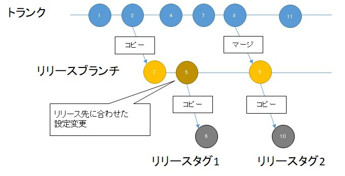
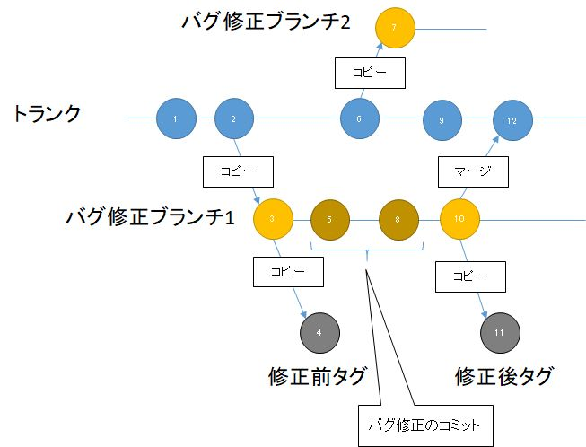
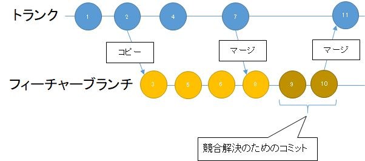
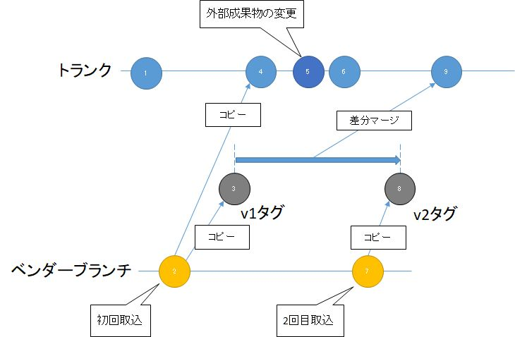

[↑目次](README.md "目次") | [← 14章 チームでの利用 - 競合の解決](14.team-use-2.md "チームでの利用 - 競合の解決") 

# チームでの利用 - より進んだ運用

これまでSVNの基本的な使い方とタグ、ブランチの操作方法について学んできました。

ただ、実際の開発において、バージョン管理はより高度で複雑な運用が求められます。
この章では、開発の現場で発生する問題と、それに対してどのようにバージョン管理を運用していくのか、いくつかの例を使って紹介します。

1. [リリースブランチ・タグ](#release-branch-and-tag)
1. [バグ修正ブランチ・タグ](#bugfix-branch-and-tag)
1. [フィーチャー(機能)ブランチ](#feature-branch)
1. [ベンダーブランチ](#vendor-branch)

## 1. リリースブランチ・タグ

### 問題

開発した成果物を出荷した後も、仕様変更や障害改修などを行い、継続して再出荷していく必要があります。
そんな時、現在どのバージョンが出荷されているのかを適切に把握していないと、ユーザーから報告された障害が既に改修済みなのかどうかが分からなくなってしまいます。

また、出荷先の環境に合わせた設定変更（例えば、サーバーの名前の変更など）が必要な場合、毎回手作業で行っていると作業が漏れる可能性があります。

### 解決策

この問題に対処するための運用方法が「リリースブランチ・タグ（Release branch/tag）」です。

図15-1 リリースブランチ・タグ

出荷（リリース）したバージョンと同期するブランチを作成し、出荷時のスナップショットをタグにしておくことで、トランクとは別に出荷バージョンをすぐに再現できるようにします。

また、出荷先の環境に合わせた変更を事前に行ってコミットしておくことで、出荷時の設定変更作業の漏れを防ぐことができます。

### 運用手順

1-2 : トランクで開発が進む

3 : 出荷用のリリースブランチをトランクをコピーして作成する

4 : リリースブランチとは別にトランクで作業が進む

5 : 出荷先に合わせてリリースブランチ上で設定変更を行う

6 : リリースのタイミングのスナップショットを、リリースタグ1としてリリースブランチから作成する

7-8 : リリースブランチ・タグとは別にトランクで作業が進む 

9 : 再度のリリースに向けて、トランクの変更をリリースブランチにマージして取り込む

10 : 再リリースのタイミングのスナップショットを、リリースタグ2としてリリースブランチから作成する

11- : またトランク上で作業が進む

### 参考

- はじめてのReleaseブランチ運用（svn編）  
  https://www.slideshare.net/masaru_b_cl/releasesvn

## 2. バグ修正ブランチ・タグ

### 問題

バグ修正を行う際、その修正が何のために行われ、どのように変更されたのかを把握する必要があります。

また、その変更作業は、対象となる成果物以外とは独立して行わないと、予期せぬ影響を与える恐れがあります。

### 解決策

この問題に対処するための運用方法が「バグ修正ブランチ・タグ（Bugfix branch/tag）」です。

図15-2 バグ修正ブランチ・タグ

バグ修正専用のブランチを作ることで、対象となる成果物以外への影響をある程度防ぐことができます。

また、バグ修正前後のスナップショットをタグとして残しておくことで、この2つのタグの差分を見れば、そのバグ修正で行われた変更が確認できます。

### 運用手順

1-2 : トランクで開発が進む

3 : バグ修正用のブランチをトランクをコピーして作成する

4 : バグ修正前の状態のスナップショットをタグとして残す

5, 8 : バグを修正してバグ修正ブランチにコミットする

6, 9 : トランクはバグ修正ブランチとは独立して開発が進む

7 : 別のバグ修正用ブランチを並行して作成できる

10 : バグの修正が完了する

11 : バグ修正後の状態のスナップショットをタグとして残す

12 : バグ修正ブランチをトランクにマージする

### トランクへのマージ

トランクへのマージの際、実際にマージされる内容は3と10のコミット間の差分になります。したがって、6, 9のトランク上のコミットでバグ修正対象に変更がないか、あっても5, 8, 10のバグ修正ブランチ上のコミットとファイル内の変更箇所が違えば、問題なくマージできます。

変更箇所が同じだった場合は、マージの際に競合が発生してしまいますが、[14章の4.競合の解決](14.team-use-2.md#resolve-conflict)の手順で、メンバーと調整してあるべき形にしてコミットしてください。

## 3. フィーチャー(機能)ブランチ

### 問題

大き目の機能追加や変更行う際、その作業が何のために行われ、どのように変更されたのかを把握する必要があります。

また、その変更作業は、対象となる成果物以外とは独立して行わないと、予期せぬ影響を与える恐れがあります。

### 解決策

この問題に対処するための運用方法が「フィーチャー(機能)ブランチ（Feature branch）」です。

図15-3 フィーチャー(機能)ブランチ

機能追加・変更専用のブランチを作ることで、対象となる成果物以外への影響を防ぐことができます。また、トランクの変更をブランチにマージすることで、最新状態に追従することもできます。

### 運用手順

1-2 : トランクで開発が進む

3 : 機能追加・変更用のブランチをトランクをコピーして作成する

4, 7 : トランクはフィーチャーブランチとは独立して開発が進む

5-6 : 機能追加のための変更を加え、フィーチャーブランチにコミットする

8 : 機能追加による競合を先に解決するため、トランクをフィーチャーブランチにマージする

9, 10 : 競合解決のために変更を加え、フィーチャーブランチにコミットする

11 : フィーチャーブランチをトランクにマージして機能追加・変更を完了する

### トランクからフィーチャーブランチへのマージ

バグ修正ブランチと同様、フィーチャーブランチもトランクとのマージ時に競合が発生する可能性があります。フィーチャーブランチはある程度影響する範囲が広いため、その可能性はより高くなります。

そのため、より安全に競合解決を行うために、トランクにマージする前に、「トランクから」逆方向にマージを行い、先に競合を解決してから、トランクにマージします。

この逆方向のマージは、バグ修正ブランチでも有効な手順です。

## 4. ベンダーブランチ

### 問題

成果物の中に組織の外部に依存するものが含まれる場合、その成果物がいつどういう理由で変更されたかを把握する必要があります。

また、外部の成果物を取り込んだ後に変更を加えたとしても、次の外部からの納品物を安全に成果物に反映させなければいけません。

### 解決策

この問題に対処するための運用方法が「ベンダーブランチ（Vendor branch）」です。

図15-4 ベンダーブランチ

ベンダーブランチでは、外部に依存する成果物を管理する専用のフォルダー(ベンダーブランチ)を作成し、そのフォルダーのブランチをトランク内のサブフォルダーとして作成します。

外部から新しい版が届いたら、ベンダーブランチ内のファイルを更新後、前回と今回の差分をトランクにマージすることで、外部成果物の変更分だけを安全にトランクに取り込むことができます。

### 運用手順

1 : トランクで開発が進む

2 : 外部から納品された初回成果物をベンダーブランチ(慣習としてcurrentフォルダー)に取り込む

3 : ベンダーブランチの初版タグ(v1)を作成する

4 : ベンダーブランチをコピーしてトランク内にブランチを作成する

5 : 外部成果物に必要な変更を加える

6 : 内部成果物の開発が進む

7 : 2回目の外部成果物をベンダーブランチに取り込む

8 : ベンダーブランチの2版タグ(v2)を作成する

9 : v1タグとv2タグの差分をトランクにマージする

### 差分のマージ

Subversionはフォルダー、ファイル単位にどのリビジョンのものかの情報も持っており、v1タグとv2タグの差分は結果的に2, 7の2コミット間の差分と同義になります。そして、マージは内部的には2つのリビジョン間の差分情報がマージ対象に適用されます。

したがって、5で外部成果物に変更を加えたとしても、2と7の間でその成果物に変更がなければ、マージ対象からは除外されます。もし変更があっても、競合が発生するため安全に競合の解決を行えます。

### 参考

- ベンダーブランチ - Subversionによるバージョン管理  
  http://www.thekyo.jp/manual/subversion/svn.advanced.vendorbr.html
- SI業界人は要チェック！！Subversionでのベンダブランチの運用手順。 - @katzchang.contexts  
  http://d.hatena.ne.jp/katzchang/20091225/p1

----------

