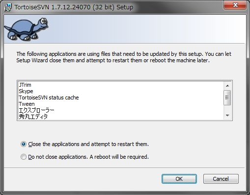

[↑目次](README.md "目次") | [← 1章 Subversion（SVN）とは？](1.what-is-svn.md "Subversion（SVN）とは？")

# SVNの導入

それでは、まずはSVNを使うために、PCにSVNをインストールしましょう。今回はエクスプローラーに統合されるSVNクライアント「TortoiseSVN」（Tortoise:トータス、陸ガメのこと）を使います。

## ダウロード

まず、インストーラーをダウンロードしましょう。[公式サイト](http://tortoisesvn.net/)にアクセスし、以下の「Downloads」タブを開きます。

図2-1 「Downloads」タブ

次に、ページ中ほどのダウンロード用バナーをクリックしてダウンロードします（本稿執筆時の最新バージョンは1.7.12）。32-bit OS用、64-bit OS用がありますので、自分の使っているWindowsと同じ方をダウロードしましょう。Windowsが32bit、64bitどちらかわからない場合は、エクスプローラーから「コンピューター」を右クリックして「プロパティ」を選択すると、確認できます。

図2-2 ダウンロード用バナー

また、さらにページの下の方にある日本語用Language Packもダウンロードしておきます。

図2-3 Language Packダウンロードリンク

## インストール

ダウンロードが終わったら、インストールを進めていきましょう。

### TortoiseSVN本体

まずは、TortoiseSVN本体をインストールしましょう。ダウンロードした「TortoiseSVN-1.7.12.24070-win32-svn-1.7.9.msi」を実行します（1.7.12.24070-win32はダウンロードしたバージョン、32/64bitにより異なります）。

図2-4 TortoiseSVNインストーラー起動

「Next」ボタンをクリックすると、ライセンス確認画面が表示されます。

図2-5 ライセンス確認

TortoiseSVNを利用するために同意すべきライセンス条項が表示されるので、「I accept the terms in the License Agreement」を選択して「Next」ボタンをクリックします。すると、インストール構成選択画面が表示されます。

図2-6 インストール構成選択

ひとまず上記画面と同じように選択して「Next」ボタンをクリックすることで、インストール実行確認画面が表示されます。

図2-7 インストール実行確認

最後に「Install」ボタンをクリックすると、インストールが始まります。

図2-8 インストール画面

インストールの途中で、次のような確認画面が表示されます。TortoiseSVNは「エクスプローラー」に統合されるため、エクスプローラーを使用しているプログラムを途中で終了させないといけません。そういったプログラムの一覧が表示され、自動的に終了しても良いかと尋ねています。

図2-9 プログラムの終了確認画面

ここでは自動的に終了させても良いものとして、「Close the applications and attempt to restart them.」を選択し「OK」ボタンをクリックしてインストールを続行します。なお、「Do not close applications. A reboot will be required.」を選択した場合、インストール後にPCの再起動が必要になります。

図2-10 インストール終了

上記画面が表示されたら、インストールは終了です。

### Language Pack

TortoiseSVN本体をインストールしたところで、今度は日本語化するために日本語Language Packをインストールします。ダウンロードした「LanguagePack_1.7.12.24070-win32-ja.msi」を実行します（1.7.12.24070-win32はダウンロードしたバージョン、32/64bitにより異なります）。

図2-11 Language Packインストーラー起動

インストールが始まります。

図2-12 Language Packインストール画面

インストールが終わると、次の画面が表示されます。

図2-13 Language Packインストール完了画面

## 初期設定

インストールが完了したら、実際に使い始める前に、初期設定を行っておきましょう。TortoiseSVNの設定を行うには、デスクトップを右クリックし、「TortoiseSVN」→「Settings」を選択します。

図2-14 TortoiseSVN設定画面起動

### 言語の選択

せっかく日本語Language Packを入れたのですから、まず言語を日本語にしておきましょう。左のペインで「General」を選択後、右のペインから「TortoiseSVN」→「Language」で日本語を選択し、「OK」ボタンをクリックします。

図2-15 言語の選択

設定後、再びデスクトップを右クリックし、TortoiseSVNが日本語されていることを確認してください。

図2-16 日本語化されたTortoiseSVN

### ファイル日時をコミット日時に合わせる

作業コピーのファイル日時をコミット日時に合わせることができます。こうすることで、他のメンバーやSVNを使っていない顧客などとも、「ファイル日時」で会話することができるようになりますので、一種の保険として設定しておきましょう。
設定するには、言語と同じく左のペインで「全般」を選択し、右のペインで「Subversion」→「ファイルの更新日時を「最終コミット日時」に設定する」のチェックを入れて「OK」ボタンをクリックします。

図2-17 ファイルの更新日時を「最終コミット日時」に設定する

以上でSVNの導入は終わりです。他にも設定できるところは色々ありますが、必要に応じて自分の好きな設定に追々と変えていけばよいでしょう。

次の章からはいよいよSVNの使い方の説明に入ります。

[→ 3章 個人での利用 - リポジトリの作成からインポート](3.personal-use-1.md "個人での利用 - リポジトリの作成からインポート")

----------

