[↑目次](README.md "目次") | [← 2章 SVNの導入](2.installing-svn.md "SVNの導入")

# 個人での利用 - リポジトリの作成からインポート

SVNを使うに当たって、まずは個人利用の範囲で基本的な操作を学んでいきましょう。SVNの開発環境の構成は、1章で述べたようにリポジトリと作業コピーからなり、チェックアウト→編集→コミットと進めていくのでしたね。

まず、本章ではリポジトリ作成からインポートまで行います。

1. [リポジトリ作成](#create-repository)
1. [リポジトリの参照](#refer)
1. [インポート](#import)

## 1. リポジトリの作成

まず最初に、リポジトリを作成しましょう。

実際の開発では既にリポジトリが用意されていることがほとんどだとは思いますが、個人用のリポジトリを作成すればあなただけのバージョン管理が可能になります。是非リポジトリの作成方法を覚えて置きましょう。

### (1) リポジトリ用フォルダー作成

PC内の任意のところに、リポジトリ用のフォルダーを作成します。今回は、D:\my_first_reposフォルダーとして作成します。

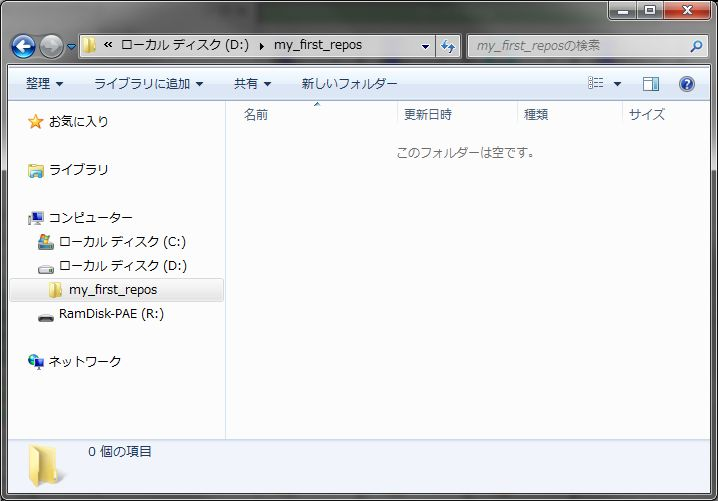

図3-1 リポジトリ用フォルダー作成

### (2) リポジトリ作成

(1)で作成したリポジトリ用フォルダ―を右クリックし、「TortoiseSVN」→「ここにリポジトリを作成」を選択します。

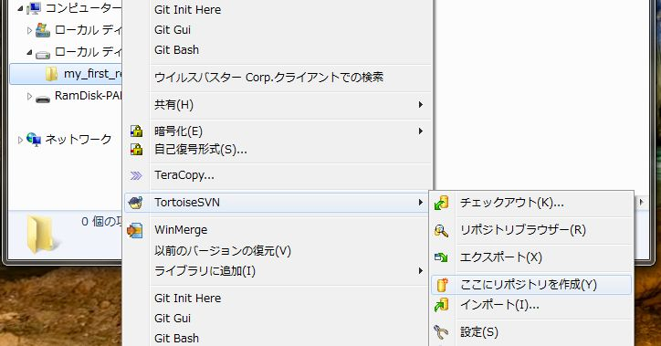

図3-2 ここにリポジトリを作成

すると、次のような「リポジトリを作成」ダイアログが表示されますが、ここではそのまま「OK」ボタンを押して先に進みます。

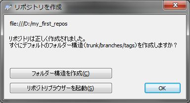

図3-3 「リポジトリを作成」ダイアログ

リポジトリが作成されます。

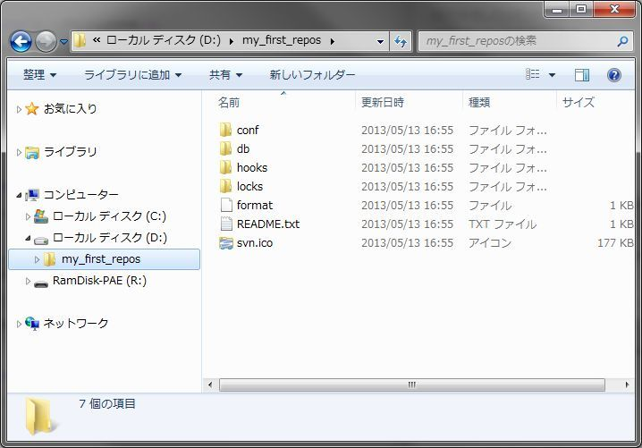

図3-4 作成されたリポジトリ

なお、作られたリポジトリの中身を見てもらうとわかるように、リポジトリと言っても特殊なものではなく、内容はただのフォルダー、ファイルで構成されています。そう思うと、少し怖さも和らぐのではないでしょうか。

## 2. リポジトリの参照

さて、リポジトリを作成しましたが、中身はまだ空のはずです。早速確認してみましょう。

リポジトリを右クリックし、「TortoiseSVN」→「リポジトリブラウザー」を選択します。

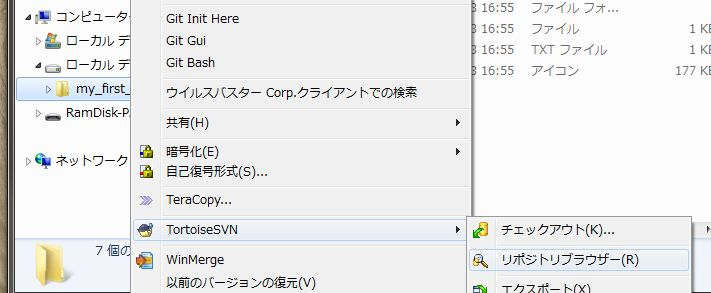

図3-5 「リポジトリブラウザー」メニュー

すると、「リポジトリブラウザー」が表示されます。「リポジトリブラウザー」はその名の通り、リポジトリの内容を参照するための画面です。表示内容から、リポジトリが空であることが確認できます。

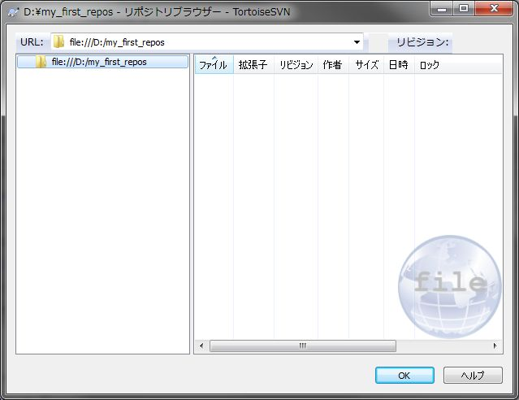

図3-6 リポジトリブラウザー

なお、リポジトリのURLは次のようになっています。

    file:///D:/my_first_repos

- `file:///` : 使用するプロトコルを表しています。他には`svn://`（svnプロトコル）や`http://`、`https://`（HTTP、HTTPSプロトコル）等をSVNではサポートしています。どのプロトコルを使うかは、SVNリポジトリの公開のされ方によります。
今回の例では、ローカルPC内のフォルダーに直接アクセスしているので、`file:///`（ファイルアクセス）を使います。
- `/` : フォルダーの区切り文字を表しています。Windowsでは`\`が使われることが一般的ですが、SVNでは`/`を使いますので注意が必要です。

## 3. インポート

リポジトリが空なので、まずはバージョン管理ファイルを登録する必要があります。その操作を「インポート」と呼びます。

まずは、バージョン管理対象としたいファイルを任意の場所に作りましょう。ここでは以下の内容のhello.txtとしておきます。

    world!

次に1.で作成したリポジトリをリポジトリブラウザーで開き、hello.txtをドラッグ＆ドロップします。

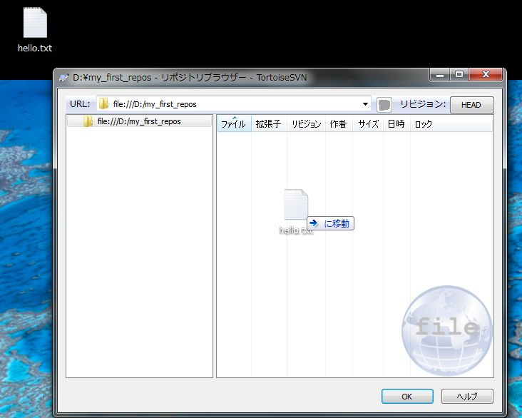

図3-7 インポート

すると、「ログメッセージを入力...」ダイアログが表示されます。

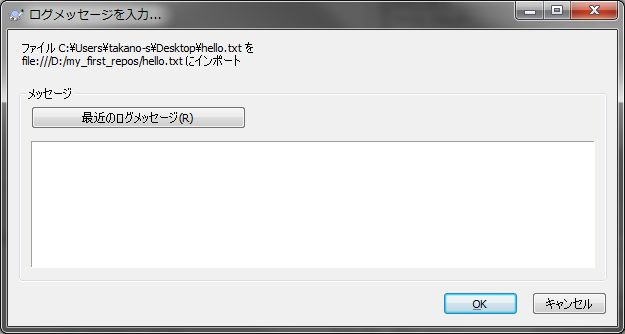

図3-8 ログメッセージを入力

ここで入力するメッセージは、SVNで履歴を参照する際に表示される大事なメッセージです。[VCS入門の第4章](https://github.com/masaru-b-cl/introduction-to-vcs/blob/master/4.end-of-world-with-only-vcs.md)で述べたように、

> - 「どのように」ではなく、その作業を「何故」「何を」「何のために」行うかをメッセージに残す

ようにしましょう。

今回は"初期インポート"と入力して、「OK」ボタンをクリックしてください。すると、インポートが完了し、リポジトリブラウザーにhello.txtが表示されます。

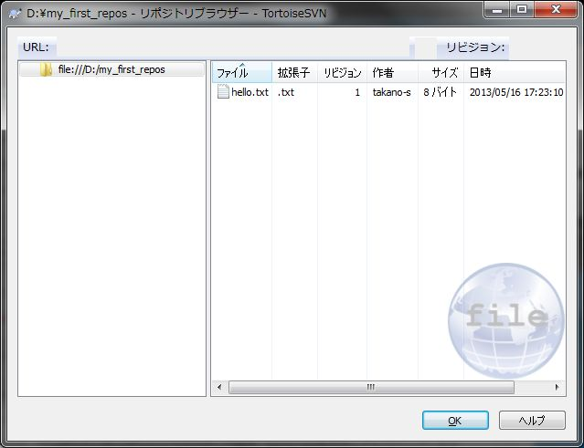

図3-9 インポート完了

入力したログメッセージを見るには、hello.txtまたはその上のフォルダー（今回はルートフォルダー）で右クリックし、「ログを表示」を選択します。

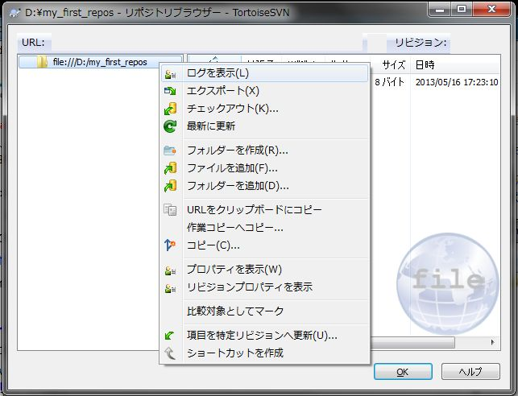

図3-10 ログを表示

「ログメッセージ」ダイアログが表示され、バージョンの履歴とログメッセージが表示されます。ここでは、リビジョン1としてhello.txtが登録されており、先ほど入力した"初期インポート"というメッセージが登録されていることが確認できます。

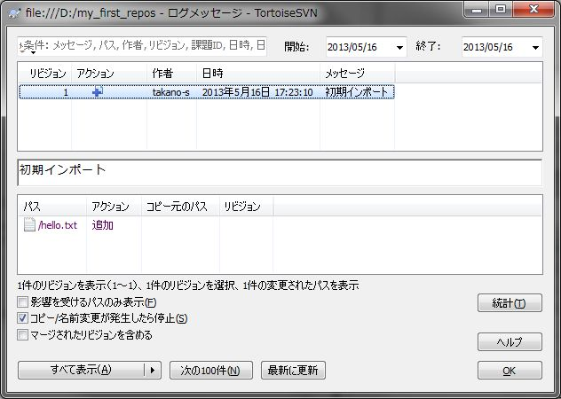

図3-11 ログメッセージ

なお、この画面ではそのバージョンで変更されたファイルも下に表示されます。また、フリーワードや日付などで検索することもできます。

さて、作業するリポジトリの準備が出来たところで、次の章では実際に変更作業を行ってみましょう。

[→ 4章 個人での利用 - 作業コピーの作成から最初のコミット](4.personal-use-2.md "個人での利用 - 作業コピーの作成から最初のコミット")

----------

