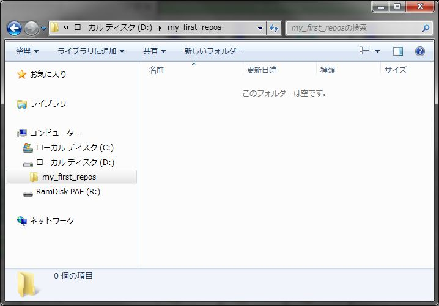
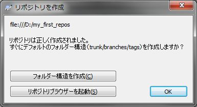
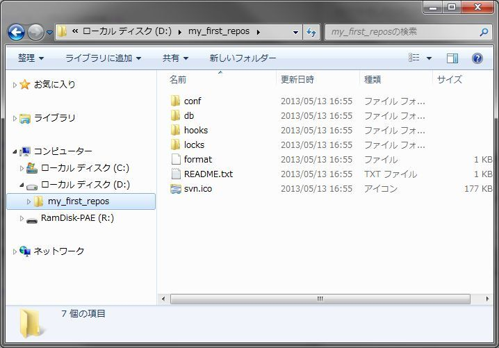

[↑目次](README.md "目次") | [← 2章 SVNの導入](2.installing-svn.md "SVNの導入")

# 個人での利用

SVNを使うに当たって、まずは個人利用の範囲で基本的な操作を学んでいきましょう。SVNの開発環境の構成は、1章で述べたようにリポジトリーと作業コピーからなり、チェックアウト→編集→コミットと進めていくのでしたね。

本章では以下の流れで説明していきます。

1. [リポジトリ作成](#create-repository)
1. [リポジトリの参照](#browse-repository)
1. インポート
1. 作業コピー作成（チェックアウト）
1. ファイル追加
1. 1度目のコミット
1. ファイル変更
1. 2度目のコミット
1. ファイル削除
1. 3度目のコミット

## <a name="create-repository">1. リポジトリの作成</a>

まず最初に、リポジトリを作成しましょう。

実際の開発では既にリポジトリが用意されていることがほとんどだとは思いますが、個人用のリポジトリを作成すればあなただけのバージョン管理が可能になります。是非リポジトリの作成方法を覚えて置きましょう。

### (1) リポジトリ用フォルダー作成

PC内の任意のところに、リポジトリ用のフォルダーを作成します。今回は、D:\my_first_reposフォルダーとして作成します。

図3-1 リポジトリー用フォルダー作成

### (2) リポジトリ作成

(1)で作成したリポジトリ用フォルダ―を右クリックし、「TortoiseSVN」→「ここにリポジトリを作成」を選択します。

図3-2 ここにリポジトリを作成

すると、次のような「リポジトリを作成」ダイアログが表示されますが、ここではそのまま「OK」ボタンを押して先に進みます。

図3-3 「リポジトリを作成」ダイアログ

リポジトリが作成されます。

図3-4 作成されたリポジトリ

なお、作られたリポジトリの中身を見てもらうとわかるように、リポジトリと言っても特殊なものではなく、内容はただのフォルダー、ファイルで構成されています。そう思うと、少し怖さも和らぐのではないでしょうか。

## <a name="browse-repository">2. リポジトリの参照</a>

さて、リポジトリを作成しましたが、中身はまだ空のはずです。早速確認してみましょう。

リポジトリを右クリックし、「TortoiseSVN」→「リポジトリブラウザー」を選択します。

図3-5 「リポジトリブラウザー」メニュー

すると、「リポジトリブラウザー」が表示されます。「リポジトリブラウザー」はその名の通り、リポジトリの内容を参照するための画面です。表示内容から、リポジトリーが空であることが確認できます。

図3-6 リポジトリブラウザー

なお、リポジトリーのURLは次のようになっています。

    file:///D:/my_first_repos

- `file:///` : 使用するプロトコルを表しています。他には`svn://`（svnプロトコル）や`http://`、`https://`（HTTP、HTTPSプロトコル）等をSVNではサポートしています。どのプロトコルを使うかは、SVNリポジトリの公開のされ方によります。  
今回の例では、ローカルPC内のフォルダーに直接アクセスしているので、`file:///`（ファイルアクセス）を使います。
- `/` : フォルダーの区切り文字を表しています。Windowsでは`\`が使われることが一般的ですが、SVNでは`/`を使いますので注意が必要です。

[→ 4章 チームでの利用](4.team-use.md "チームでの利用")

----------

