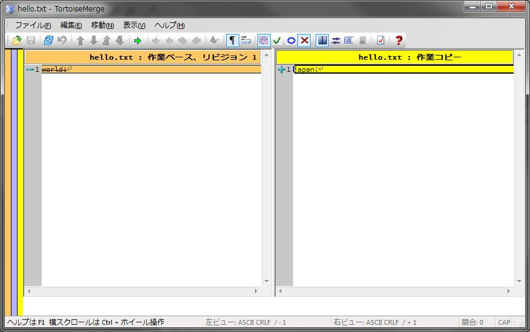

[↑目次](README.md "目次") | [← 3章 個人での利用 - リポジトリの作成からインポート](3.personal-use-1.md "個人での利用 - リポジトリの作成からインポート")

# 個人での利用 - 作業コピーの作成から最初のコミット

前章で作業対象のリポジトリが出来ましたので、次は変更作業を次の手順で行いましょう。

1. [作業コピーの作成（チェックアウト）](#1-)
1. [ファイルの変更](#2-)
1. リポジトリーへの反映（コミット）

## 作業コピーの作成（チェックアウト）

まず最初に、リポジトリを元に作業コピーを作成しなければなりません。この作業のことを「チェックアウト」と呼びます。

まず、リポジトリブラウザでリポジトリを表示し、チェックアウト対象フォルダーを右クリックして「チェックアウト」を選択します。

図4-1 チェックアウト

すると、「チェックアウト」ダイアログが表示されます。「チェックアウト先のディレクトリ」を作業コピーを作成したい任意のフォルダーに変更して、「OK」ボタンをクリックしてください。
「チェックアウト先のディレクトリ」は、存在しないフォルダーを指定しても構いません（チェックアウト時に自動的にフォルダーが作成されます）。今回は、D:\first_workspaceとしましょう。

図4-2 「チェックアウト」ダイアログ

チェックアウトが行われ、次の「チェックアウト 終了」ダイアログが表示されます。

図4-3 「チェックアウト 終了」ダイアログ

チェックアウトされたファイルをエクスプローラーで確認すると、確かに作業コピーが作成されたことが確認できます。

図4-4 作業コピーの確認

なお、first_workspaceフォルダーやhello.txtファイルにチェックマークのようなアイコンが追加されていることがわかると思います。これはTortoiseSVNの機能の一つで、作業コピー内のフォルダー、ファイルの状態を表示してくれているのです。チェックマークのようなアイコンは、作業コピーがチェックアウトされた時から変更されていないことを表しています。

## ファイルの変更

次に、ファイルを変更してみましょう。作業コピー内のhello.txtをテキストエディターで開き、

    world!

から

    japan!

に変更して保存してください。

すると、エクスプローラーの表示が次のように変わります。この赤丸内に"!"のアイコンは、ファイルが変更されたことを表しています。

図4-5 ファイル変更後の表示

この時、赤丸"!"アイコンの付いたファイルを右クリックし「SVN 差分を表示」を選択すると、リポジトリと作業コピーのファイルの差分が確認できます。この差分を表示しているのはTortoiseMergeというツールです。

図4-6 SVN 差分を表示

図4-7 TortoiseMergeによる差分表示

左側がリポジトリのファイル、右側が作業コピーのファイルの内容で、緑色の箇所は削除された行、黄色の箇所は追加された行を表しています。今回の変更では一つの行の内容を変更したので、結果的に1行削除して1行追加した扱いになっています。

ちなみに、これまで「リポジトリのファイル」と表現していますが、実際には「作業ベース」といって、「作業の元となるリビジョン」と比較しています。作業ベースについては、後程詳しく説明しますので、今のところはリポジトリとの比較という認識で良いです。

なお、ファイル単位の差分は上記の手順で確認できましたが、フォルダー単位の差分については、作業コピーのフォルダーを右クリックして、「TortoiseSVN」→「変更をチェック」と選択することで、確認できます。

図4-8 変更をチェック

図4-9 変更チェック結果

ダイアログには変更されたファイルの一覧が表示されます。一覧内のファイルをダブルクリックすることで、図4-7と同じようにファイル単位の差分を表示できます。

----------

