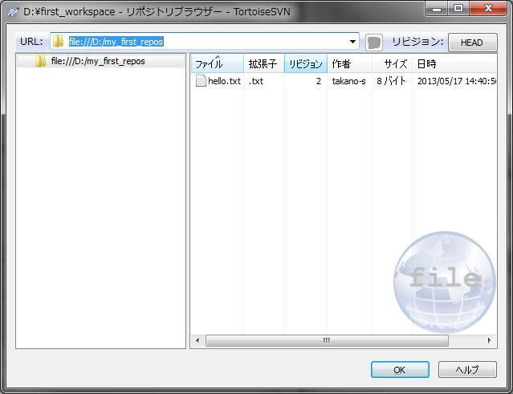

[↑目次](README.md "目次") | [← 3章 個人での利用 - リポジトリの作成からインポート](3.personal-use-1.md "個人での利用 - リポジトリの作成からインポート")

# 個人での利用 - 作業コピーの作成から最初のコミット

前章で作業対象のリポジトリが出来ましたので、次は変更作業を次の手順で行いましょう。

1. [作業コピーの作成（チェックアウト）](#checkout)
1. [ファイルの変更](#modify)
1. [リポジトリへの反映（コミット）](#commit)

## 1. 作業コピーの作成（チェックアウト）

まず最初に、リポジトリを元に作業コピーを作成しなければなりません。この作業のことを「チェックアウト」と呼びます。

まず、リポジトリブラウザでリポジトリを表示し、チェックアウト対象フォルダーを右クリックして「チェックアウト」を選択します。

図4-1 チェックアウト

すると、「チェックアウト」ダイアログが表示されます。「チェックアウト先のディレクトリ」を作業コピーを作成したい任意のフォルダーに変更して、「OK」ボタンをクリックしてください。
「チェックアウト先のディレクトリ」は、存在しないフォルダーを指定しても構いません（チェックアウト時に自動的にフォルダーが作成されます）。今回は、D:\first_workspaceとしましょう。

図4-2 「チェックアウト」ダイアログ

チェックアウトが行われ、次の「チェックアウト 終了」ダイアログが表示されます。

図4-3 「チェックアウト 終了」ダイアログ

チェックアウトされたファイルをエクスプローラーで確認すると、確かに作業コピーが作成されたことが確認できます。

図4-4 作業コピーの確認

なお、first_workspaceフォルダーやhello.txtファイルにチェックマークのようなアイコンが追加されていることがわかると思います。これはTortoiseSVNの機能の一つで、作業コピー内のフォルダー、ファイルの状態を表示してくれているのです。チェックマークのようなアイコンは、作業コピーがチェックアウトされた時から変更されていないことを表しています。

## 2. ファイルの変更

次に、ファイルを変更してみましょう。作業コピー内のhello.txtをテキストエディターで開き、

    world!

から

    japan!

に変更して保存してください。

すると、エクスプローラーの表示が次のように変わります。この赤丸内に"!"のアイコンは、ファイルが変更されたことを表しています。

図4-5 ファイル変更後の表示

この時、赤丸"!"アイコンの付いたファイルを右クリックし「SVN 差分を表示」を選択すると、リポジトリと作業コピーのファイルの差分が確認できます。この差分を表示しているのはTortoiseMergeというツールです。

図4-6 SVN 差分を表示

図4-7 TortoiseMergeによる差分表示

左側がリポジトリのファイル、右側が作業コピーのファイルの内容で、緑色の箇所は削除された行、黄色の箇所は追加された行を表しています。今回の変更では一つの行の内容を変更したので、結果的に1行削除して1行追加した扱いになっています。

ちなみに、これまで「リポジトリのファイル」と表現していますが、実際には「作業ベース」といって、「作業の元となるリビジョン」と比較しています。作業ベースについては、後程詳しく説明しますので、今のところはリポジトリとの比較という認識で良いです。

なお、ファイル単位の差分は上記の手順で確認できましたが、フォルダー単位の差分については、作業コピーのフォルダーを右クリックして、「TortoiseSVN」→「変更をチェック」と選択することで、確認できます。

図4-8 変更をチェック

図4-9 変更チェック結果

ダイアログには変更されたファイルの一覧が表示されます。一覧内のファイルをダブルクリックすることで、図4-7と同じようにファイル単位の差分を表示できます。

## 3. リポジトリへの反映（コミット）

さて、ファイルを変更したので、リポジトリに反映させなければいけません。リポジトリに反映する作業を「コミット」と呼びます。

コミットするには、作業コピーの変更したファイルを右クリックし、「SVN コミット」を選択します。

図4-10 SVN コミット

すると、「コミット」ダイアログが表示され、コミット対象の一覧を確認したり、ログメッセージを入力したりできます。前章でも述べたように、分かりやすいログメッセージを入力しましょう。ここではログメッセージに"あいさつ先を日本に変更する"と入力して、「OK」ボタンをクリックしてください。

図4-11 「コミット」ダイアログ

インポートの時と同じように、「コミット 終了」ダイアログが表示されます。

図4-12 コミット後の「コミット 終了」ダイアログ

そして、エクスプローラーを見ると、アイコンが「変更なし」を表すチェックマークに変わっています。

図4-13 アイコン状態

それでは、リポジトリを確認してみましょう。リポジトリブラウザーを開くと、今行ったコミット結果が反映され、リビジョンが2になっていることが確認できます。

図4-14 コミット後のリポジトリ

ログも見てみましょう。ログは前章で紹介したリポジトリブラウザーから表示する方法の他、作業コピーの対象フォルダー、ファイルを右クリックして、「SVN ログを表示」を選択することでも表示できます。

図4-15 SVN ログを表示

図4-16 コミット後のログ

ログを見ると、先ほど行ったコミットがログメッセージとともに確認できます。

なお、ログの履歴から、その一つ前のバージョン、任意のバージョンとの差分を表示することもできます。リビジョン2のログを右クリックして「直前のリビジョンと比較」、または任意の2つのバージョンを選択（Ctrlキーを押しながらクリックすることで可能）して「リビジョンを比較」を選択すれば、差分が表示されます。

図4-17 直前のリビジョンと比較

図4-18 リビジョンを比較

さて、これでファイルを変更して履歴を残していき、各バージョンの差分を参照することができるようになりました。次の章では、ファイルの追加、削除を扱います。

[→ 5章 個人での利用 - 追加と削除](5.personal-use-3.md "個人での利用 - 追加と削除")

----------

