[↑目次](README.md "目次") | [← 4章 個人での利用 - 作業コピーの作成から最初のコミット](4.personal-use-2.md "個人での利用 - 作業コピーの作成から最初のコミット")

# 個人での利用 - 追加と削除

前の章まででチェックアウトしてファイルを変更し、コミットすることができるようになりました。今度はファイルの追加、削除を行ってみましょう。

1. [ファイル追加](#add)
1. [ファイル削除](#remove)

## 1. ファイル追加

まず、新しいファイルを作業コピーのフォルダーに作成しましょう。以下の内容で"こんにちは.txt"を作成してください。

    世界

まだこの段階では、SVNの管理対象としていないため、エクスプローラーで見てもアイコンが表示されません。

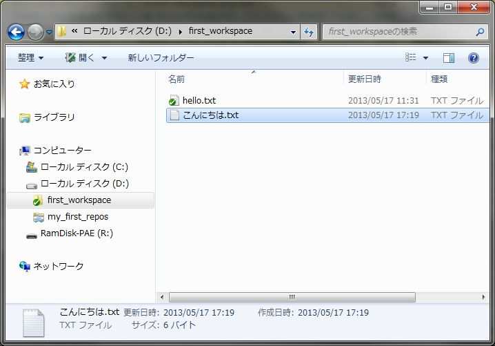

図5-1 追加前

SVNの管理対象に追加するには、対象ファイルを右クリックして「SVN 追加」を選択します。

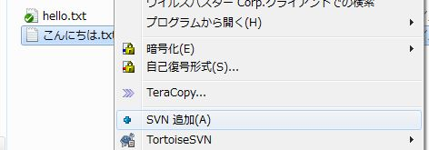

図5-2 SVN 追加

すると、SVNの管理対象に追加され、青い"+"マークのアイコンが表示されます。

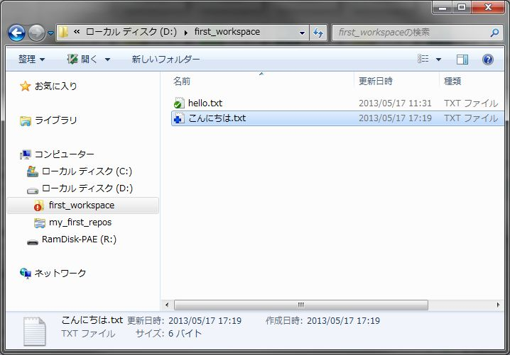

図5-3 追加後

これで終わり……ではありません。今作業しているのが「作業コピー」であることを思い出しましょう。作業コピーの内容は、コミットしないとリポジトリには反映されません。

したがって、変更の時と同じように、コミットを行う必要があります。早速コミットしてみましょう（メッセージなどは省略します）。コミットを終えると、チェックマークのアイコンに切り替わります。

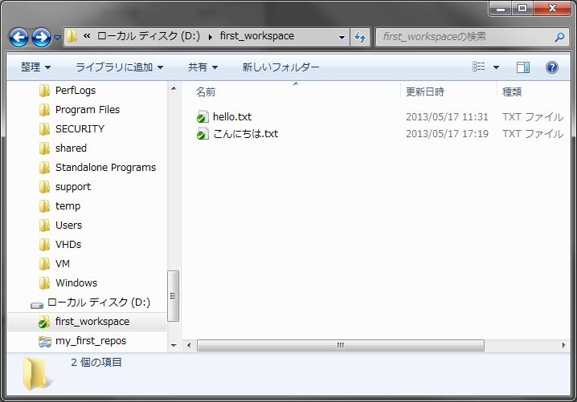

図5-4 追加のコミット後

リポジトリブラウザーでも確認してみましょう。"こんにちは.txt"がリビジョン3として追加されたことが確認できます。

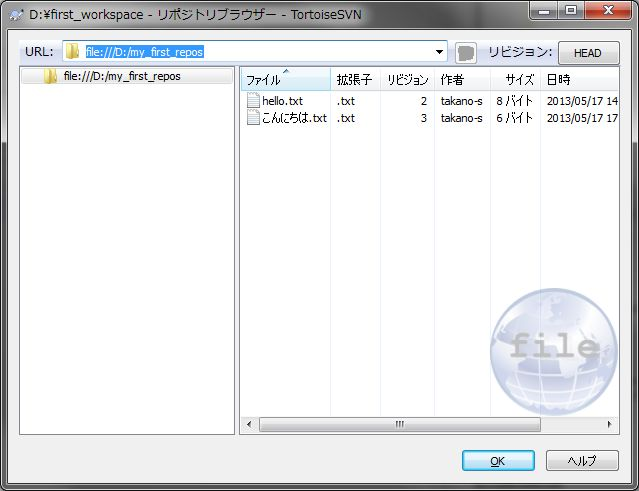

図5-5 コミット後のリポジトリ

ここで"hello.txt"のリビジョンが2のままであることに注意してください。これは、最後に何らかの変更を行ったリビジョンを表示しているためです。"hello.txt"は今回はいじっていないため、リビジョンが2のままになっているのです。

## 2. ファイル削除

次はファイルを削除してみましょう。さきほど作成した"こんにちは.txt"を削除します。

まず、作業コピーの"こんにちは.txt"を右クリックして、「SVN 削除」を選択します。

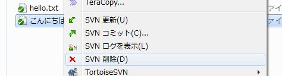

図5-6 SVN 削除

すると、"こんにちは.txt"が削除されます。ここまではエクスプローラー上で普通に削除するのと変わりませんが、よく見ると作業コピーのフォルダーに赤丸に"!"マークのアイコンが付いていることが分かります。

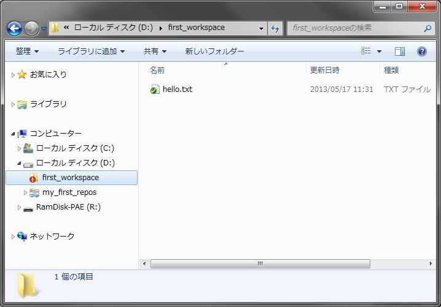

図5-7 削除後

これは追加の時も同じですが、「削除した」という情報をコミットしないとリポジトリに反映できないためです。ただ、削除したファイルは既にありません。どうしたらよいでしょうか？

ここで、SVNがフォルダーツリーを管理しているVCSだということを思い出してください。つまり、"こんにちは.txt"が削除されたという情報は、作業コピーのフォルダー側で管理しているのです。

したがって、ファイルの削除を伴う場合、削除したファイルがあったフォルダーでコミットをすればよいのです。

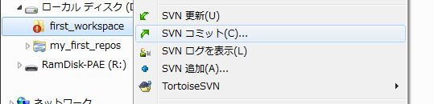

図5-8 フォルダーでのコミット

コミット後にリポジトリブラウザーを開くと、削除されていることが確認できます。

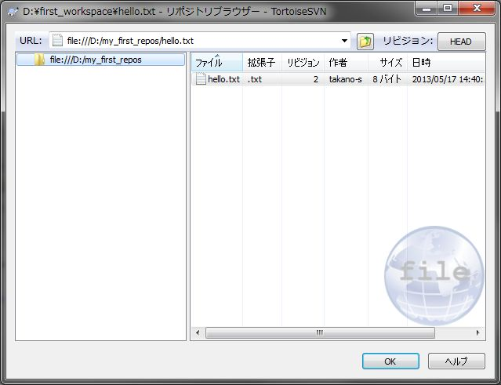

図5-9 削除のコミット後

また、ログにもしっかりと残っています。

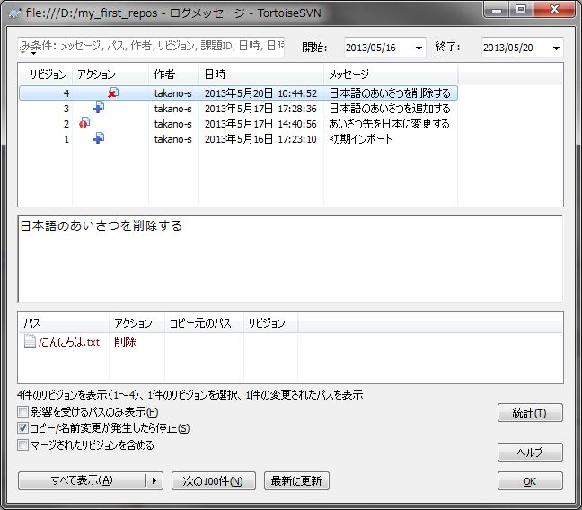

図5-10 削除のログ

なお、ここまでは作業コピーにてファイルを削除する方法を説明してきましたが、リポジトリーブラウザー上で直接削除することもできます。ただ、「意味のあるまとまり」ごとに削除することができなくなりますので、あまりお勧めができないやり方です。

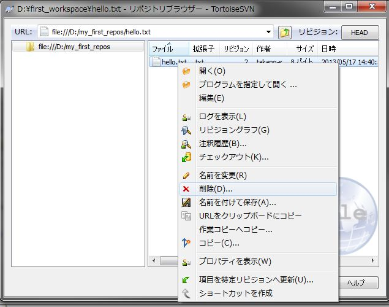

図5-11 リポジトリブラウザー上での削除

ここまでで、追加、変更、削除ができるようになり、一通りの作業が進められるようになりました。次はVCSに不可欠な再現するための機能を説明します。

[→ 6章 個人での利用 - 変更を元に戻す](6.personal-use-4.md "個人での利用 - 変更を元に戻す")

----------

