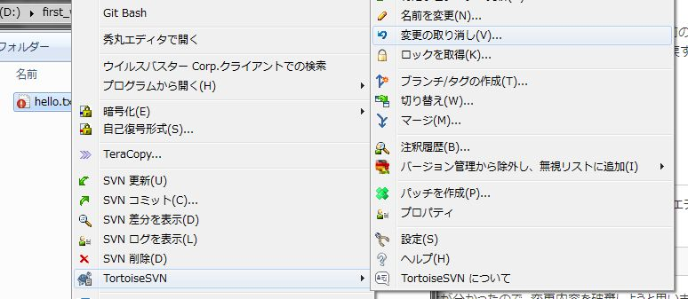
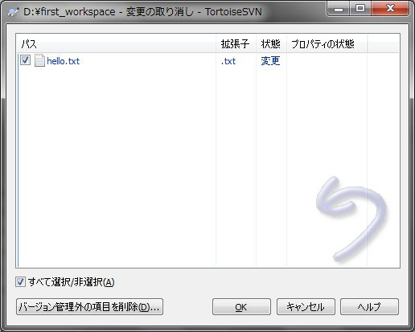
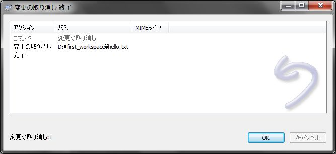
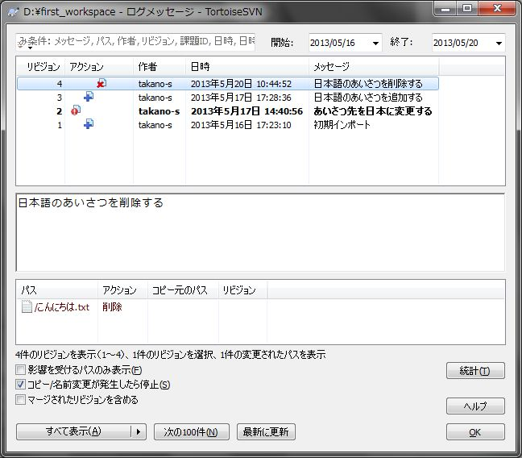
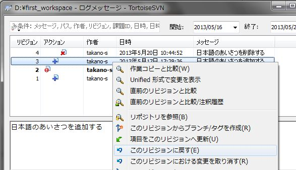
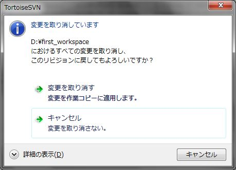
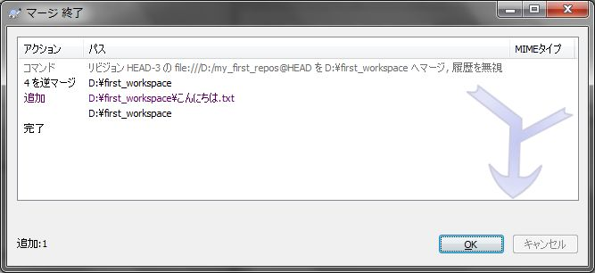
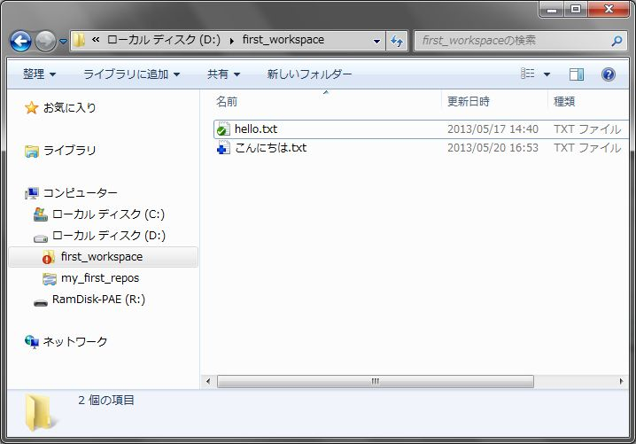

[↑目次](README.md "目次") | [← 5章 個人での利用 - 追加と削除](5.personal-use-3.md "個人での利用 - 追加と削除")

# 個人での利用 - 変更を元に戻す

作業を進める中で、色々変更したんだけど無かったことにして一からやり直したい、3日前の状態に戻したい、といったケースが出てくることがあります。そんな時のために、SVNには「元に戻す」という機能が用意されています。

1. [コミット前に元に戻す](#revert-in-pre-commit)
1. [過去のバージョンに戻す](#revert-to-post-version)

## 1. コミット前に元に戻す

作業途中で今の対応内容を破棄したいケースを考えます。"hello.txt"ファイルをテキストエディターで開き、内容を以下のように変更して保存します。

    china!

しかし、後からこの変更は不要だということが分かったので、変更内容を破棄しようと思います。その際、もう一度テキストエディターで

    japan!

に直すこともできますが、修正漏れ、間違いが発生する可能性が常に残ります。この可能性を0にするにはVCSの力を借りるのが正解です。SVNでは「元に戻す」という操作を使います。

まず、エクスプローラーで"hello.txt"を右クリックし、「変更の取り消し」を選択します。

図6-1 変更の取り消し

すると、「変更の取り消し」ダイアログが表示されるので、取り消したいファイルにチェックがついていることを確認して、「OK」ボタンをクリックします。その後、「変更の取り消し 終了」ダイアログが表示されれば完了です。

図6-2 「変更の取り消し」ダイアログ

図6-3 「変更の取り消し 終了」ダイアログ

エクスプローラー上で、"hello.txt"のアイコンが未変更状態に戻っていること、また内容が

    japan!

に戻っていることを確認してください。

## 2. 過去のバージョンに戻す

次に「3日前の状態に戻したい」というケースを考えます。簡単に思いつくのは、SVNのログをたどって過去の状態を参照し、作業コピーの内容に手で写すといったものです。
しかし、この方法も漏れ、間違いが発生する可能性が高いため、ツールの力を借りましょう。SVNでは「リビジョンに戻す」という機能が用意されています。

まず、戻したいファイル、フォルダーのログを表示します。今回は作業コピーのフォルダーのログを表示します。

図6-4 作業コピーのログ

戻したいリビジョンを右クリックして「このリビジョンに戻す」を選択します。今回はリビジョン3「日本語のあいさつを追加する」のリビジョンに戻してみましょう。

図6-5 このリビジョンに戻す

次に確認ダイアログが表示されるので、「変更を取り消す」を選んでクリックします。すると、「マージ 終了」ダイアログが表示され、操作が完了します。

図6-6 変更取消の確認ダイアログ

図6-7 「マージ 終了」ダイアログ

その後、エクスプローラーで作業コピーを見ると、リビジョン3の状態のファイル、フォルダーが復元されていることが分かります。
そして、「元に戻す」作業を行った最新の状態に対して、戻したいリビジョンの状態を反映した（マージした）ため、差分があればその状態が作業コピーの状態がアイコンで表示されます。今回の例でいえば、"こんにちは.txt"が追加された状態で表示されます。

図6-8 リビジョン3に戻した後

あとは、この状態でコミットすれば、リポジトリに反映されます。

なお、戻したコードに対して変更を加えたい場合でも、まずは一度戻した直後で一度コミットし、その後変更を加えて再度コミットするといった手順を踏むことをお勧めします。これは、VCS入門でも述べましたが、1つの変更で1つのコミットとすることで、後で参照しやすくする狙いがあります。

次の章では個人使用の最後として、バージョン管理対象への除外設定方法を学びます。

[→ 7章 個人での利用 - 除外設定](7.personal-use-5.md "個人での利用 - 除外設定")

----------

