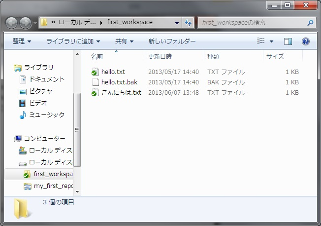

[↑目次](README.md "目次") | [← 6章 個人での利用 - 変更を元に戻す](6.personal-use-4.md "個人での利用 - 変更を元に戻す")

# 個人での利用 - 除外設定

作業を行っている中で、「自動で生成される」ファイル、フォルダーというものが出てくることがあります。たとえば、プログラムをコンパイルしたバイナリーファイルであるとか、エディターが自動で作成するバックアップファイルなどです。

こういったファイル、フォルダーはバージョン管理する必要がないため、SVNに登録してはいけません。しかし、単にインポートしてしまうと自動で登録されてしまいます。

そんな時は、インポート後に「除外設定」行うことで、以後はバージョン管理対象から外れますし、「登録されていないファイル、フォルダー」としてSVNに指摘されることもなくなります。

## 除外設定手順

では、除外設定の手順を学んでいきましょう。まず作業コピーの中に擬似的にバックアップファイルができた状態を作ります。hello.txtをコピーしてhello.txt.bakファイルを作ってください。

図7-1 バックアップファイルの作成

このままでは除外されませんので、「変更をチェック」すると「バージョン管理外」のファイルとして表示されてしまいます。

図7-2 「バージョン管理外」のファイル

除外設定を行うには、対象のファイルを右クリックして、「TortoiseSVN」→「無視リストに追加」を選択します。さらに、このファイルだけなのか、拡張子を指定して除外するのかを選べます。今回はバックアップファイルすべてを除外対象としたいので、"*.bak"の方を選択します。

図7-3 無視リストに追加

処理を終えると次のダイアログが表示されます。

図7-4 「無視リストに追加」完了ダイアログ

再び「変更をチェック」してみると、フォルダーが変更されています。これはどういうことかというと、除外設定はフォルダーに対する「プロパティ（属性）」として設定されるということです。したがって、除外設定後はフォルダーのコミットが必要です。

なお、親フォルダーの除外設定は子フォルダーに引き継がれますので、すべてのフォルダーで除外したいファイルは、作業コピーのルートフォルダーで除外設定するとよいでしょう。

図7-5 フォルダーの変更あり

ではコミットします。

図7-6 フォルダーのコミット

以上で、除外設定は終わりです。除外設定をうまく使って、バージョン管理対象物を最小限にしておくようにしましょう。

さて、ここまでで個人で使用する範囲では主要な操作方法が理解できたのではないかと思います。今度は複数人のチームでの連携方法について学んでいきますが、まずはその前に「タグ」と「ブランチ」について、簡単に次の章で説明します。

[→ 8章 タグとブランチ - デフォルトフォルダー構造](8.tag-and-branch-1.md "タグとブランチ - デフォルトフォルダー構造")

----------

