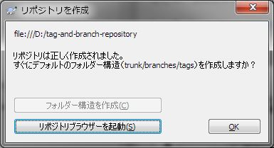

[↑目次](README.md "目次") | [← 7章 個人での利用 - 除外設定](7.personal-use-5.md "個人での利用 - 除外設定")

# タグとブランチ - デフォルトフォルダー構造

チーム開発の説明に入る前に、タグとブランチについて説明しておきましょう。

1. [タグとブランチとは](#whats-tag-and-branch)
1. [デフォルトフォルダー構造の作成](#create-default-folder-structure)

## 1. タグとブランチとは

タグ（tag）とブランチ（branch）とは、SVNのVCSとしての特性を実現するための機能です。VCSとしての特性をVCS入門から引用します。

> [VCS入門 2章「VCSでできること」](https://github.com/masaru-b-cl/introduction-to-vcs/blob/master/2.power-of-vcs.md "VCS入門 2章「VCSでできること」")より
> 
> 履歴が残ると何ができるのか。大まかには次の3つができるようになります。
> 
> - 参照
> - 再現
> - 分岐

この「参照」する際の基準として、特定バージョンにマークを付けるのに使うのが「タグ」です。そして「分岐」するために使用するのが「ブランチ」です。

SVNではタグもブランチも、対象となるバージョンのコピーとして実現します。つまり、どちらも作成直後は対象バージョンの「スナップショット」なのです。

ではどう違うのかというと、タグはスナップショットを撮ったら変更しませんが、ブランチはスナップショットを撮った後もともとのバージョンとは独立して成長（つまり分岐―枝分かれ―）させます。また、ブランチについては、分岐後にもともとのバージョンに統合させることもあります。

役割の違いがあるとはいえ、どちらもコピーを使うということは同じであり、何らかの名前付けの基準がないと混乱してしまいます。そこで、SVNを使う際は、次のフォルダー階層にするのが慣例となっています。

    root
     |
     +- branches <- ブランチ用フォルダー
     |
     +- tags <- タグ用フォルダー
     |
     +- trunk <- 開発のメインライン用フォルダー

ここで、リポジトリを作成しようとした時のことを思い出してみてください。引用します。

> 3章 「[1.リポジトリの作成](/3.personal-use-1.md#create-repository)」より
> 
> 
> 
> 図3-3 「リポジトリを作成」ダイアログ

「すぐにデフォルトのフォルダー構造（trunk/branches/tags）を作成しますか？」と聞かれていますね。ここで、「フォルダー構造を作成」ボタンをクリックすると、リポジトリを作成するとともに、上述のフォルダー構成を最初に作ってくれるのです。

## 2. デフォルトフォルダー構造の作成

それではタグ、ブランチを使うために、デフォルトのフォルダー構造で新たにリポジトリを作成しましょう。

まず、新たにリポジトリ用フォルダーを作成します。D:\tag-and-branch-repositoryとでもしておきましょう。

図8-1 リポジトリ用フォルダー作成

そして3勝の手順で「リポジトリ作成」ダイアログを表示した後、「フォルダー構造を作成」ボタンをクリックします。処理に成功すると、次のダイアログが表示されます。

図8-2 デフォルトフォルダー構造作成成功ダイアログ

ダイアログを「OK」ボタンを押して閉じると、「リボ時鳥の作成」ダイアログの「フォルダー構造を作成」ボタンが無効化されています。

図8-3 無効化された「フォルダー構造を作成」ボタン

作成されたリポジトリをリポジトリブラウザーで表示すると、デフォルトのフォルダー構造が作成されたことを確認できます。

図8-4 デフォルトのフォルダー構造の確認

これで、タグとブランチを扱う準備は完了です。次の章では、実際にタグを作成してみましょう。

[→ 9章 タグとブランチ - タグの作成](9.tag-and-branch-2.md "タグとブランチ - タグの作成")

----------

