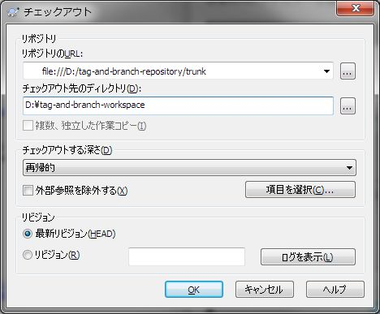
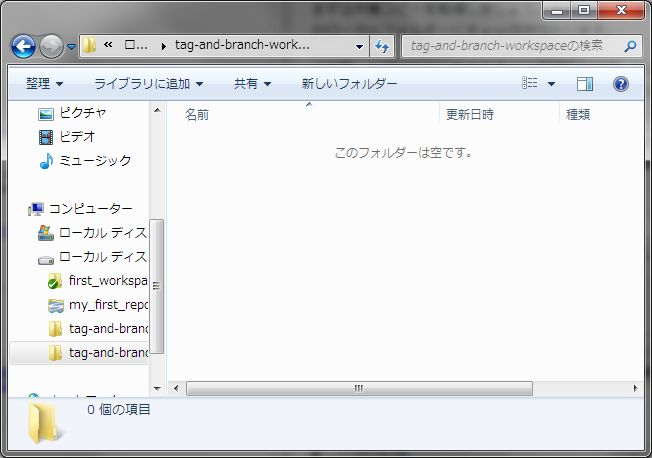
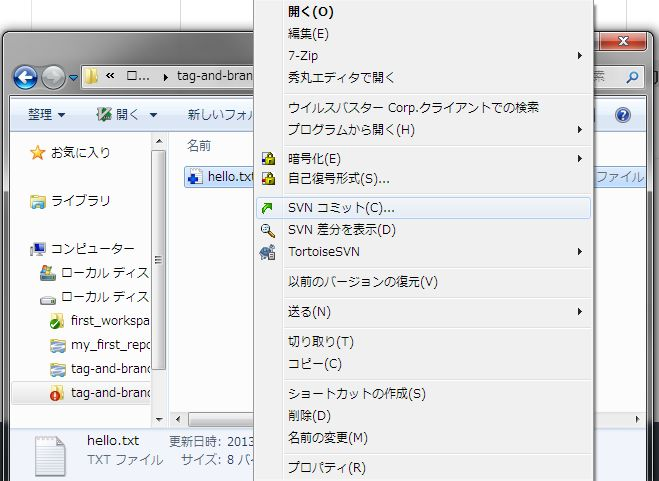

[↑目次](README.md "目次") | [← 8章 タグとブランチ - デフォルトフォルダー構造](8.tag-and-branch-1.md "タグとブランチ - デフォルトフォルダー構造")

# タグとブランチ - タグの作成

本章では実際にタグを作成し、タグを使ったバージョン操作について学びましょう。

1. [チェックアウト](#checkout)
1. [ファイルの作成、コミット](#create-file-and-commit)
1. [タグの作成](#create-tag)
1. [更なるコミット](#commit-more)
1. [タグに戻す](#reset-to-tag)
1. [タグのエクスポート](#export-from-tag)

## 1. チェックアウト

まずは作業コピーを取得しましょう。手順は[第4章](4.personal-use-2.md)を参照し、作成したリポジトリーを任意のローカルフォルダーにチェックアウトします。

この時、リポジトリー全体をチェックアウトせず、trunkフォルダーをチェックアウトするようにしましょう。これは、開発のメインラインはtrunkフォルダーであり、普段はtags、branchesフォルダーを意識する必要がないためです。

図9-1 trunkフォルダーのチェックアウト

まだ何もインポートしていないので、作業フォルダーは空です。

図9-2 空の作業フォルダー

## 2. ファイルの作成、コミット

次に、ファイルを作成してコミットします。第3章と同じhello.txtファイルを作成し、追加、コミットしてください。

図9-3 hello.txtの追加、コミット

----------

