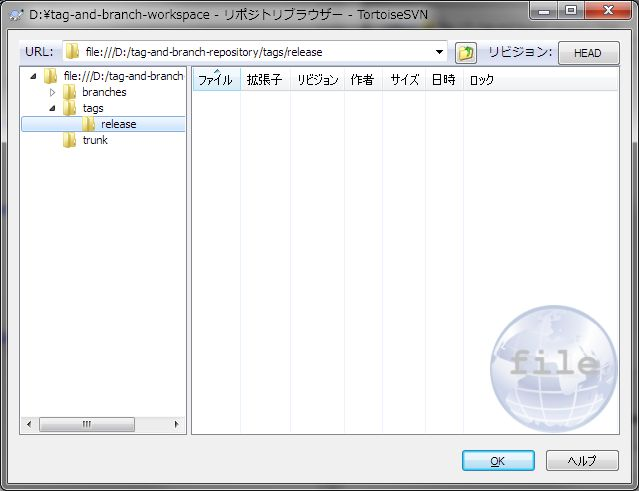

[↑目次](README.md "目次") | [← 8章 タグとブランチ - デフォルトフォルダー構造](8.tag-and-branch-1.md "タグとブランチ - デフォルトフォルダー構造")

# タグとブランチ - タグの作成

本章では実際にタグを作成する方法について学びましょう。

1. [チェックアウト](#checkout)
1. [ファイルの作成、コミット](#create-file-and-commit)
1. [タグの作成](#create-tag)

## 1. チェックアウト

まずは作業コピーを取得しましょう。手順は[第4章](4.personal-use-2.md)を参照し、作成したリポジトリーを任意のローカルフォルダーにチェックアウトします。

この時、リポジトリー全体をチェックアウトせず、trunkフォルダーをチェックアウトするようにしましょう。これは、開発のメインラインはtrunkフォルダーであり、普段はtags、branchesフォルダーを意識する必要がないためです。

図9-1 trunkフォルダーのチェックアウト

まだ何もインポートしていないので、作業フォルダーは空です。

図9-2 空の作業フォルダー

## 2. ファイルの作成、コミット

次に、ファイルを作成してコミットします。第3章と同じhello.txtファイルを作成し、追加、コミットしてください。

図9-3 hello.txtの追加、コミット

## 3. タグの作成

では、いよいよタグを作成します。タグは前述のとおりフォルダーのコピーとして作成します。したがって、作業コピーではなくリポジトリブラウザーで作業を行います。まずはリポジトリブラウザーを開いてください。

図9-4 リポジトリブラウザー

タグはtagsフォルダーに作成しますが、今回はリリースタグ扱いとして、まずはreleaseフォルダーを作成しましょう。tagsフォルダーを右クリックして、「フォルダーを作成」を選択します。

図9-5 フォルダーを作成

「フォルダーを作成」ダイアログが表示されるので、「新しい名前」欄に作成するフォルダー名、今回は"release"を入力し、「OK」ボタンをクリックします。

図9-6 「フォルダーを作成」ダイアログ

すると、ログメッセージの入力を求められますので、これまでと同様に入力して「OK」ボタンをクリックします。

図9-7 フォルダー作成ログメッセージ入力

リリースタグ用フォルダーが作成されました。

図9-8 作成されたリリースタグ用フォルダー

準備ができましたので、タグを作成します。作成するには、 **マウスの右ボタン** でtrunkフォルダーをtags/releaseフォルダーにドラッグ＆ドロップします。すると、コピー、移動処理の仕方を選択するコンテキストメニューが表示されますので、「ここにコピーして名前を変更」を選択します。

図9-9 ここにコピーして名前を変更

すると「名前を変更」ダイアログが表示されるので、作成するタグの名前を入力して「OK」ボタンをクリックします。今回はバージョン1.0のリリース扱いということで、"v1.0"としました。

図9-10 タグ名の入力

例によってログメッセージの入力を求められますので、入力して「OK」ボタンをクリックします。

図9-11 タグ作成時のログメッセージ入力

これでタグの作成が完了です。

次の章では、タグを使ってバージョンを復元したり、特定のバージョンの成果物を取得する方法を学びます。

[→ 10章 タグとブランチ - タグの復元とエクスポート](10.tag-and-branch-3.md "タグとブランチ - タグの復元とエクスポート")

----------

